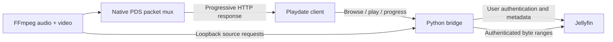

# Jellyfin client implementation

The client now also supports the [native Jellyfin plugin](PLUGIN.md), including
PDI posters. Select the connection backend in settings. The companion sections
below describe the retained Python bridge; its bearer key is distinct from the
Jellyfin user token used in plugin mode.

## Interface and design preview

The client uses a native one-bit interface with the server name in its masthead,
bitmap headings, inverted selection rows, and drawn icons. Library rows show
runtime and watch progress, with a scrollbar and explicit page/selection counts.
Show and season screens display their poster beside the child list. These screens
and title details reserve a 96×144 poster area from the first frame, with a
placeholder while artwork is loading or unavailable. Paging, retry, and back
navigation retain the parent context. Details give titles up to two lines; long
text is ellipsized. Playback controls
sit over the video, retaining its last frame through pause, seek, and buffering.
The title and right-aligned status share one header line; controls fade after
three seconds of playback. Text is rendered literally, including underscores and asterisks
in media names. Rendering lives in `client/ui.lua`; navigation remains in
`client/main.lua`.

To check the interface and generate screenshots with isolated sample media:

```sh
nix develop path:. --command make ui-preview
```

Or run `make ui-preview` with `PLAYDATE_SDK_PATH` and `SIMULATOR` configured.
This launches a separate Simulator app, exercises the real navigation with
in-memory network/player fixtures, writes 400×240 screenshots to
`build/design-preview/`, and exits. The target checks the pass marker in
`build/design-preview.log`. It covers crank scrolling, both paging directions,
empty lists, details, resume/seek controls, back navigation, and retry. This is
an interface check; it also tests delayed show/season artwork and compares every
pixel outside the poster slot before and after loading. Streaming itself is covered by the separate native playback
test below. It does not read `.env` or contact the configured Jellyfin server.

## Companion architecture

The device talks only to its configured companion. The companion authenticates
one Jellyfin user and exposes short, paginated JSON responses and native PDS
streams. It never sends the user's Jellyfin password/token or source URL to the
device. A separate bearer key authenticates the Playdate to the bridge.



## Routes

| Route | Purpose |
| --- | --- |
| `GET /health` | Public bridge liveness; does not claim Jellyfin authentication |
| `GET /api/status` | Configured server identity |
| `GET /api/libraries` | Video-capable user libraries |
| `GET /api/items?parent=…&start=…` | Browse pages of twenty items |
| `GET /api/items?search=…` | Search playable video |
| `GET /api/items?view=resume` | Continue watching |
| `GET /api/items/{id}` | Details, runtime, saved position |
| `POST /api/play` | Create a session from `{id, position}` |
| `GET /api/stream/{session}.pds` | Consume that session once |
| `GET /api/session/{session}` | Conversion/transport status |
| `POST /api/session/{session}/progress` | Save a decoded playback position |
| `POST /api/session/{session}/stop` | Cancel conversion and report stopping |

All `/api/` routes require `Authorization: Bearer <BRIDGE_TOKEN>`. JSON bodies
are limited to 4 KiB. Pages are capped at twenty items and reduced to fields
needed by the 400×240 UI. Metadata responses are bounded on both sides.

An opaque internal source URL is accessible only from loopback and only while
its matching job is streaming. FFmpeg uses that URL for byte-range source reads.
The source handler forwards requests to the configured Jellyfin origin, not a
client-supplied URL. Credentials are attached in HTTP headers by Python;
FFmpeg arguments and output logs contain no Jellyfin credentials. Upstream
redirects to a different origin are rejected.

## Playback lifecycle

Creating a session validates user access and resolves a finite media source.
The stream starts two FFmpeg processes: one generates packed one-bit frames,
the other generates MP3. The packet mux interleaves them by integer sample
clocks. It does not generate a full video file or cache the full source.

The client waits for about one second of video before starting audio. Playback
position comes from the native video frame index plus the session's starting
position. Every ten seconds it reports that position; queued progress requests
are coalesced if the control connection is slow. Encoding completion is never
used to claim a movie was watched.

Pause closes the stream and records position. Resume/seek creates a new stream
from that position, using input seeking on the authenticated HTTP source. This
avoids indefinite paused buffers and does require a short new buffering period.
One conversion lock prevents overlapping encoders; cancellation interrupts both
FFmpeg processes even if a pipe read is blocked. Abandoned unconsumed sessions
expire, and a missing playback heartbeat is eventually reported as stopped at
the last confirmed position.

The native API cannot reliably distinguish end of file from a transport cut.
After the transport closes and video buffers drain, the client checks the
bridge's session status and its decoded position before showing Finished.
Interrupted playback offers retry from the last decoded position.

## Upstream API references

The implementation was checked against Jellyfin's own controller definitions:
[user authentication](https://github.com/jellyfin/jellyfin/blob/v10.11.11/Jellyfin.Api/Models/UserDtos/AuthenticateUserByName.cs),
[library queries](https://github.com/jellyfin/jellyfin/blob/v10.11.11/Jellyfin.Api/Controllers/ItemsController.cs),
[user views](https://github.com/jellyfin/jellyfin/blob/v10.11.11/Jellyfin.Api/Controllers/UserViewsController.cs),
[playback sources](https://github.com/jellyfin/jellyfin/blob/v10.11.11/Jellyfin.Api/Controllers/MediaInfoController.cs),
and [progress reporting](https://github.com/jellyfin/jellyfin/blob/v10.11.11/Jellyfin.Api/Controllers/PlaystateController.cs).

The connected server was Jellyfin 10.11.11. The working requests used the
`X-Emby-Authorization: MediaBrowser …` compatibility header and an explicit
`JellyfinPDS/0.2.0` user agent. An earlier request without that combination was
rejected. We did not independently isolate which header change accounted for
the difference, so no broader proxy diagnosis is claimed.

The bridge renews a username/password login once when an authenticated request
returns 401/403. This matters when a second login for the same client/device
invalidates its cached token. Explicitly supplied user tokens cannot be renewed
without account credentials; replace them in `.env` and recreate the container.

## Validation boundary

The Simulator library browser loaded all four video libraries on the user's
server. The user selected a real video and confirmed working picture and audio.
The user also verified all twelve flash/beep pairs in the original diagnostic.
There was no physical-device test, at the user's explicit request.

Automated integration tests use an isolated HTTP server with Jellyfin-shaped
responses and generated media. They run actual FFmpeg source requests, range
reads, seeks, MP3 decoding, cancellation, and native packet validation. Those
tests are separate from, and do not replace, the live Simulator check.

The final suite passed **14 tests** both in the pinned Nix environment and in
the production Docker image. A separate native Simulator run exercised play,
pause at 0.4 seconds, resume, seek to 1.8 seconds, and stop at 2.0 seconds; all
three stop/progress reports were checked against the isolated Jellyfin fixture.
An earlier native harness run timed out; the instrumented rerun passed and its
full state transitions are preserved in
[native-smoke-result.json](evidence/native-smoke-result.json).

Automatic reauthentication was also verified against the live server by logging
in again for the same client/device and successfully reloading all four
libraries through the bridge. That check did not play media or report watch
progress. See [live-bridge-check.json](evidence/live-bridge-check.json).

The optional native test is `tests/run_native_smoke.py`. Run it in an SDK
environment with `--result` set to the Simulator's actual
`Disk/Data/com.scribhneoir.jf-native-smoke/result.json` path. It creates a temporary
local Jellyfin fixture and builds `build/NativeSmoke.pdx`; it neither reads `.env`
nor uses the real account. Its audio can be routed to a dedicated sink while
retaining native fileplayer volume 1.
