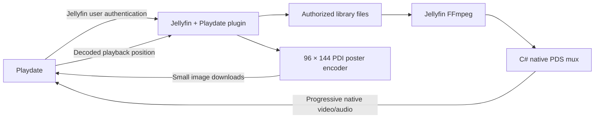

# Jellyfin Playdate plugin

Version 0.3.0 targets **Jellyfin 10.11.11 / .NET 9**. It is an independently
implemented C# plugin: Python, a separate HTTP service, and the Playdate SDK are
not required on the Jellyfin server. The server's FFmpeg needs `libmp3lame`.

## Installation

### From the Jellyfin dashboard

Open **Dashboard → Plugins → Repositories → Add** and enter:

```text
https://raw.githubusercontent.com/scribhneoir/jellyfin-playdate/main/manifest.json
```

Install **Playdate** from the Catalog and restart Jellyfin. The
[latest client release](https://github.com/scribhneoir/jellyfin-playdate/releases/latest)
includes the unconfigured client in `Jellyfin-Plugin.zip`.

### Publishing a repository

Prepare the files for a static web host with its ZIP download directory URL:

```sh
make plugin-repository REPOSITORY_URL=https://your-host.example/playdate
```

Or reuse an already built DLL without Docker:

```sh
python3 tools/package_plugin.py --repository-url https://your-host.example/playdate
```

Upload the files in `build/repository/` to that directory. The URL to add in the
dashboard is then `https://your-host.example/playdate/manifest.json`. Both the
manifest and ZIP must be directly downloadable by the Jellyfin server. This is
ordinary static file hosting, required for installation and updates only.

GitHub also works: host `manifest.json` on a public branch or GitHub Pages and
upload the ZIP as a release asset. In that case, set `REPOSITORY_URL` to the
release asset directory, such as
`https://github.com/OWNER/REPO/releases/download/v0.3.0`, and add the manifest's
raw-content URL in Jellyfin. The manifest and ZIP can live at different hosts.

The repository ZIP contains the DLL at its root; Jellyfin creates the versioned
plugin directory and installed metadata. The manifest records the exact ZIP's
MD5 checksum, as required by Jellyfin 10.11, and a SHA-256 sidecar is also provided.
Regenerate the manifest whenever the ZIP changes. The manual ZIP below has a
different directory layout and must not replace the repository ZIP.

### Manual installation

Build with Docker and Python 3.11+:

```sh
make plugin-package
```

Or build with a locally installed .NET 9 SDK:

```sh
dotnet build plugin/Jellyfin.Plugin.Playdate.csproj -c Release -o build/plugin
python3 tools/package_plugin.py
```

The ZIP and SHA-256 checksum are in `build/`. Stop Jellyfin before installing or
updating the assembly. Extract `Jellyfin.Plugin.Playdate-0.3.0.zip` into the
server data directory's `plugins/` directory, then start Jellyfin. In the
official Jellyfin container this is `/config/plugins/Playdate/`. The dashboard
should list **Playdate 0.3.0.0** as active. No extra media mounts are needed: the
plugin reads files already accessible to Jellyfin.

The build deliberately pins the server API version. Other Jellyfin versions
need a compatible build and validation; changing `meta.json` alone does not
establish compatibility. To uninstall, stop Jellyfin, remove just the `Playdate`
plugin directory, and start Jellyfin again.

The prepared client package is `build/Jellyfin-Plugin.zip`. It contains an empty
connection template; configure its Connection screen or rebuild with the helper
below after installing the plugin. The existing private bridge build is separate.

## Connect the client

Use `.env` with raw values, without shell quotes:

```dotenv
JELLYFIN_URL=https://your-jellyfin-server
JELLYFIN_USERNAME=your-user
JELLYFIN_PASSWORD=your-password
```

```sh
python3 tools/configure_plugin.py
export PLAYDATE_SDK_PATH=/path/to/PlaydateSDK
make client-package
```

The helper checks the plugin endpoint and writes `client/local_config.lua` with
mode 0600. It authenticates a dedicated `playdate-pds-client` device, separate
from the old bridge. Existing `.env` credentials are not modified. Existing
on-device settings take precedence; use **Menu → Connection → Use bundled
connection** after rebuilding, or select **Jellyfin plugin**, enter the server
URL and user token, and select **Connect**.

The URL is Jellyfin's root, including any configured base path; the client adds
`/Playdate` itself. The plugin uses a user login token, not an administrator API
key. The password stays on the computer. The configured `.pdx`/ZIP and the
Playdate's connection data contain the user token and must be kept private.
Use Jellyfin's device/session controls to revoke it, then run configuration again.

## Architecture



`ILibraryManager`, `IUserViewManager`, and `IDtoService` provide paginated,
user-scoped browsing. `IMediaSourceManager` selects a local finite video and its
default audio track. `IMediaEncoder.EncoderPath` supplies Jellyfin's FFmpeg.
Two bounded pipes produce monochrome video and mono MP3; `PdsEncoder` interleaves
native packets on integer clocks. No full-video staging file is created.

The Playdate requests short, numbered PDS segments. Each contains whole packets,
at most 64 KiB, with an exact `Content-Length`. Concatenating them reproduces the
continuous stream byte for byte. Segments normally contain one second of video;
the encoder keeps one segment pending to identify the final response and queues
at most two more. This adds about two seconds of initial server buffering, while
keeping memory bounded and conversion progressive. The client uses one native
player throughout; it advances only after that player has consumed every byte
in the current response. `X-Pds-Final: 1` identifies the last segment.

This transport avoids HTTP chunk framing, which SDK 3.1.1's native player does
not decode correctly. JSON and PDI responses also have known lengths. The client
remains Lua-only and needs no C compiler or ARM toolchain. A normal reverse proxy
can forward these endpoints; keep `Content-Length` and `X-Pds-Final` intact and
do not transform the binary response. The plugin sends `no-store, no-transform`.

The plugin permits one active conversion at a time and binds playback sessions
to the authenticated user and token. It checks permissions again before
streaming. A stop request or cancelled segment request interrupts FFmpeg. Unconsumed sessions
expire after 60 seconds; active playback without a progress heartbeat is stopped
after 45 seconds using only the last client-confirmed position. Encoding EOF
never marks a title watched. Progress and stopping go through `ISessionManager`,
so Jellyfin owns resume/watched policy and active-session updates.

## API

All routes require Jellyfin authentication. No caller-supplied file path, source
URL, or user ID is accepted. Request bodies are limited to 4 KiB.

| Route under `/Playdate/api` | Purpose |
| --- | --- |
| `GET /status` | Server, user, plugin version |
| `GET /libraries` | Visible video libraries |
| `GET /items?parent=…&start=…` | Pages of 20 items |
| `GET /items?search=…` | Search video |
| `GET /items?view=resume` | Continue watching |
| `GET /items/{id}` | Details and poster revision |
| `GET /items/{id}/poster.pdi` | Native 96×144 image |
| `POST /play` | `{id, position}` → new playback session |
| `GET /stream/{session}.pds` | Consume the session once |
| `GET /stream/{session}/parts/{index}` | Sequential, length-delimited segments used by Playdate |
| `GET /session/{session}` | Playback status |
| `POST /session/{session}/progress` | `{position, paused}` |
| `POST /session/{session}/stop` | `{position}`; idempotent stop |

Poster lookup uses primary art, falling back to a parent image when available.
FFmpeg resizes, pads, and dithers it; C# writes an opaque native PDI. Each image
is 1,760 bytes. The server keeps at most 256 converted images in memory, with
cache keys based on source path, size, modification time, and encoder revision.
Authorization is checked before cache access. The Playdate keeps at most 64
files, invalidates changed artwork by revision, and clears cached art when the
connection/account changes. Client 0.3.1 shows the show's poster beside its seasons
and the season's poster beside its episodes. Show, season, and title details
reserve a fixed poster area: a placeholder remains while loading or when art is
unavailable, so text and controls keep their positions. This client update works
with plugin 0.3.0.

## Isolated test setup

Generate original fixtures (requires FFmpeg), then install the built plugin in
a disposable Jellyfin instance. These commands do not read production `.env`:

```sh
python3 tests/setup_plugin_test.py --prepare
make plugin-package
cp build/plugin/Jellyfin.Plugin.Playdate.dll build/plugin/meta.json build/jellyfin-test/config/plugins/Playdate/
docker run -d --name jellyfin-playdate-test --user "$(id -u):$(id -g)" \
  -p 127.0.0.1:8097:8096 \
  -v "$PWD/build/jellyfin-test/config:/config" \
  -v "$PWD/build/jellyfin-test/cache:/cache" \
  -v "$PWD/build/jellyfin-test/media:/media:ro" \
  jellyfin/jellyfin:10.11.11
python3 tests/setup_plugin_test.py
make plugin-test
```

`plugin_integration.py` checks authentication, denied libraries, transcoding
permissions, session ownership, paging, PDI pixels, progressive PDS decoding,
seek, cancellation, saved progress, silent video, and abandoned sessions. The
expiry test takes about a minute. Stop the test container before replacing its
loaded DLL. Test credentials remain in ignored `build/jellyfin-test/connection.json`.

`tests/run_plugin_native.py` compiles an isolated Simulator app and checks real
PDI downloads, every poster pixel, caching, video pixels, play, pause/resume,
seek, stop, and a complete 12-second playback.
Pass `--sdk`, `--simulator`, and `--data` (the Simulator data directory for
`com.scribhneoir.jf-plugin-smoke`). It never reads the production `.env`.
The Simulator test app needs its normal network permission on first launch.

`make plugin-repository-test` uses the built DLL in fresh disposable Jellyfin and
Nginx containers. It tests repository catalog discovery, the actual package
download and checksum check, installation, and the active plugin API after a
restart. It uses a random loopback port and generated credentials, removes its
containers and network afterward, and does not read `.env` or change either the
existing test server or production. Its result is `build/plugin-repository-result.json`.

For the proxy check, start an isolated Nginx and add `--proxy` to the native test:

```sh
docker run -d --name jellyfin-playdate-proxy-test \
  --link jellyfin-playdate-test:jellyfin -p 127.0.0.1:8098:80 \
  -v "$PWD/tests/nginx.conf:/etc/nginx/conf.d/default.conf:ro" nginx:stable-alpine
```

This tests a real local reverse proxy. It does not establish that the user's
production Cloudflare configuration works; the plugin has not been installed
on the live server.

## Scope

This version supports server-local finite video files, one conversion at a time,
the default audio track, and primary posters. It does not yet support live TV,
remote `.strm` sources, disc images, subtitles, an audio-track picker, or automatic
next-episode playback. Video without audio gets a silent MP3 track for the native
playback clock. Hardware and long Wi-Fi playback remain untested at the user's
request; native streaming is an undocumented Playdate API.

See [the recorded validation results](PLUGIN-RESULTS.md).

Implementation references: [Jellyfin plugin guide](https://github.com/jellyfin/jellyfin-plugin-template),
[10.11.11 library queries](https://github.com/jellyfin/jellyfin/blob/v10.11.11/Jellyfin.Api/Controllers/ItemsController.cs),
[media sources](https://github.com/jellyfin/jellyfin/blob/v10.11.11/MediaBrowser.Controller/Library/IMediaSourceManager.cs),
and [playback reporting](https://github.com/jellyfin/jellyfin/blob/v10.11.11/Jellyfin.Api/Controllers/PlaystateController.cs).
